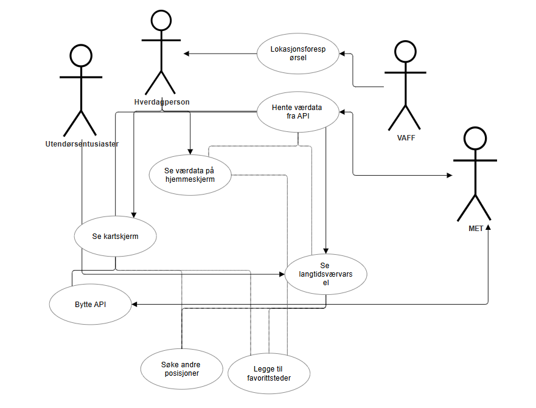
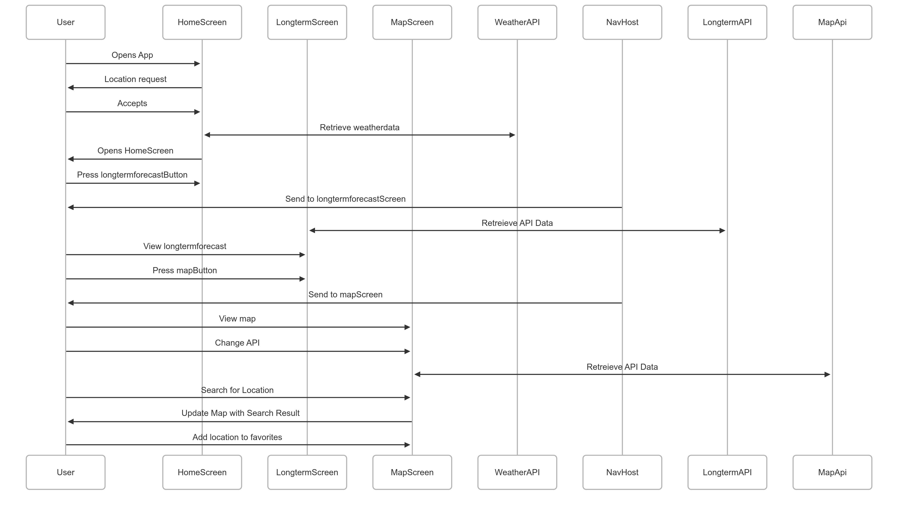
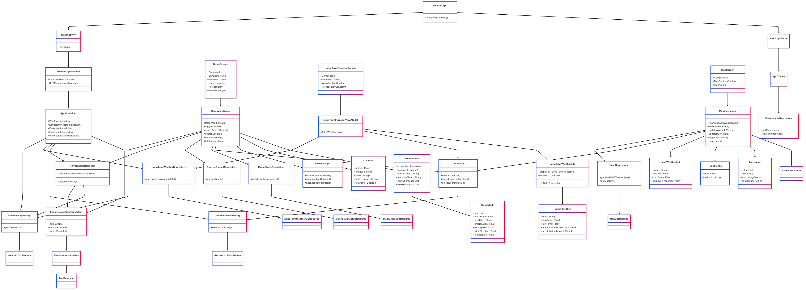
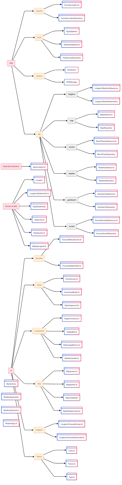
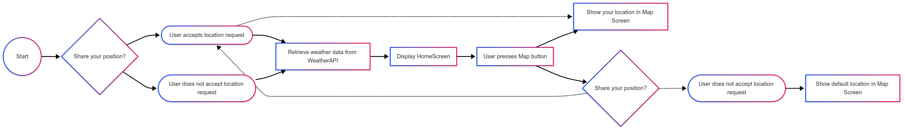

MODELING.md

## TEKSTILG BESKRIVELSE AV VIKTIGSTE USE-CASE
1. GPS og Stedsøk
   Som en bruker av vær-appen ønsker jeg å kunne gi appen tilgang til enhetens GPS, for automatisk å se værdata for min nåværende posisjon, samt ha muligheten til å søke etter steder manuelt, slik at jeg kan få relevante væroppdateringer uansett hvor jeg er.

Akseptansekriterier:

a. Appen spør brukeren om tillatelse til å bruke GPS.
b. Etter at brukeren gir tillatelse, viser appen automatisk værdata for brukerens nåværende posisjon.
c. Brukeren kan manuelt søke etter andre steder via en søkefunksjon i appen.
----------------------------------------------------------------------------------------------------
2. Værdata med Varsler
   Som en bruker av vær-appen ønsker jeg å se værdata som inkluderer sanntids- og langtidsvarsler, slik at jeg kan planlegge dagene mine på time-for-time prognoser for de kommende ukene.

Akseptansekriterier:

a. Appen viser prognoser time-for-time for de neste 24 timene.
b. Appen viser ukesvarsler for været, hentet fra Meteorologisk institutt.

----------------------------------------------------------------------------------------------------
3. Interaktivt Kart
   Som en bruker av vær-appen ønsker jeg å interagere med et kart som viser værdata, inkludert muligheten til å velge mellom forskjellige lag av vær, slik at jeg kan visualisere værforholdene på en intuitiv måte.

Akseptansekriterier:

a. Kartet viser værdata som temperatur, nedbør og vind i form av raster tiles.
b. Brukeren kan velge mellom forskjellige visualiseringer og lag på kartet.
c. Kartet oppdateres interaktivt basert på valg fra brukeren.
----------------------------------------------------------------------------------------------------
4. Favorittsteder
   Som en bruker av vær-appen ønsker jeg å kunne lagre steder som favoritter, slik at jeg raskt kan få tilgang til værdata for disse stedene når som helst.

Akseptansekriterier:

a. Brukeren kan lagre steder som favoritter i appen.
b. Favoritter lagres lokalt ved hjelp av en Room-database.
c. Lister over favorittsteder vises lett tilgjengelig og oppdateres kontinuerlig med værdata.
----------------------------------------------------------------------------------------------------
## USE-CASE
Disse use-casene blir representert i et use-case diagram:


----------------------------------------------------------------------------------------------------
## SEKVENSDIAGRAM
Videre har vi valgt å lage sekvensdiagram for å vise hovedfunksjonaliteten i applikasjonen.
Vi ønsker at det skal vise hvordan hovedfunksjonaliteten henger sammen samt hvordan flyten ser ut i applikasjonen:


```bash
sequenceDiagram
participant User
participant HomeScreen
participant LongtermScreen
participant MapScreen
participant WeatherAPI
participant NavHost
participant LongtermAPI
participant MapApi


User ->> HomeScreen: Opens App
HomeScreen ->> User: Location request
User ->> HomeScreen: Accepts
HomeScreen <<->> WeatherAPI: Retrieve weatherdata
HomeScreen ->> User: Opens HomeScreen

User ->> HomeScreen: Press longtermforecastButton
NavHost ->> User: Send to longtermforecastScreen
LongtermScreen <<->> LongtermAPI: Retreieve API Data
User ->> LongtermScreen: View longtermforecast

User ->> LongtermScreen: Press mapButton
NavHost ->> User: Send to mapScreen
User ->> MapScreen: View map
User ->> MapScreen: Change API
MapScreen <<->> MapApi: Retreieve API Data
User ->> MapScreen: Search for Location
MapScreen ->> User: Update Map with Search Result
User ->> MapScreen: Add location to favorites

```
----------------------------------------------------------------------------------------------------
## KLASSEDIAGRAM
Vi har laget klassediagram med som viser all funksjonalitet i applikasjonen og hvordan disse filene henger sammen.
Vi har valgt å gjøre dette for å utvide use-casene for å vise den helhetlige sammenhengen av applikasjonen.
Dette har vi tatt med for å igjen vise hvordan filene henger sammen, men også for å vise funksjonene vi bruker.



```bash
classDiagram
class WeatherApp {
+navigateToScreen()
}

    class MainActivity {
        +onCreate()
    }

    class WeatherApplication {
        +AppContainer container
        +GPSManager gpsManager
    }

    class AppContainer {
        +WeatherRepository
        +LongTermWeatherRepository
        +FavoritesStateHolder
        +GeoSearchRepository
        +FavoriteLocationRepository
    }

    class HomeScreen {
        +Composable
        +SkyBackground
        +WeatherContent
        +HourlyForecast
        +ForecastDay
        +WeatherWidgets
    }

    class LongTermForecastScreen {
        +Composable
        +WeatherContent
        +WeekSectionHeader
        +ForecastDayLongterm
    }

    class MapScreen {
        +Composable
        +MapSettingsContent
        +mapApiInfo
    }

    class HomeViewModel {
        +fetchWeatherData()
        +toggleFavorite()
        +selectSearchResult()
        +searchLocation()
        +fetchSunTimes()
        +fetchMoonPhase()
    }

    class LongTermForecastViewModel {
        +fetchWeatherData()
    }

    class MapViewModel {
        +fetchAvailableWeatherApis()
        +selectWeatherApi()
        +updateAvailableTimes()
        +updateHueRotate()
        +toggleAnimation()
        +mapLegend()
    }

    class FavoritesStateHolder {
        +toggleFavorite()
        +favoritesWithWeather: StateFlow
    }

    class GeoSearch {
        +searchLocation()
        +searchNearestLocation()
        +selectSearchResult()
    }

    class GPSManager {
        +startLocationUpdates()
        +stopLocationUpdates()
        +hasLocationPermission()
    }

    class WeatherRepository {
        +getWeatherData()
    }

    class LongTermWeatherRepository {
        +getLongtermWeatherData()
    }

    class MapRepository {
        +getAvailableWeatherApis()
        +getMapStyle()
    }

    class FavoriteLocationRepository {
        +addFavorite()
        +removeFavorite()
        +toggleFavorite()
    }

    class GeoSearchRepository {
        +searchLocations()
    }

    class SunriseSunsetRepository {
        +getSunTimes()
    }

    class MoonPhaseRepository {
        +getMoonPhasePercent()
    }

    class PreferencesRepository {
        +getThemeMode()
        +saveThemeMode()
    }

    class Location {
        +latitude: Float
        +longitude: Float
        +name: String?
        +displayName: String?
        +isFavorite: Boolean
    }

    class WeatherInfo {
        +properties: Properties
        +location: Location?
        +currentTemp: String
        +feelsLikeTemp: String
        +hourlyForecast: List
        +weeklyForecast: List
    }

    class LongTermWeatherInfo {
        +properties: LongTermProperties
        +location: Location?
        +getDailyForecast()
    }

    class MapWeatherApi {
        +name: String
        +baseUrl: String
        +maxZoom: Float
        +apiLayerProperties: Array
    }

    class ApiLegend {
        +color: List<Pair<Color, String>>
        +text: String
        +icon: ImageVector
        +background: Color?
    }

    class TimedLinks {
        +time: String
        +webpUrl: String
    }

    class DailyForecast {
        +date: String
        +maxTemp: Float
        +minTemp: Float
        +precipitationProbability: Double
        +precipitationAmount: Double
    }

    class HourlyData {
        +hour: Int
        +hourRange: String
        +condition: String
        +precipitation: Float
        +windSpeed: Float
        +windDirection: Float
        +temperature: Float
    }

    WeatherApp --> MainActivity
    MainActivity --> WeatherApplication
    WeatherApplication --> AppContainer
    AppContainer --> WeatherRepository
    AppContainer --> LongTermWeatherRepository
    AppContainer --> FavoritesStateHolder
    AppContainer --> GeoSearchRepository
    AppContainer --> FavoriteLocationRepository

    HomeScreen --> HomeViewModel
    LongTermForecastScreen --> LongTermForecastViewModel
    MapScreen --> MapViewModel

    HomeViewModel --> WeatherRepository
    HomeViewModel --> FavoritesStateHolder
    HomeViewModel --> SunriseSunsetRepository
    HomeViewModel --> MoonPhaseRepository
    HomeViewModel --> GeoSearch
    HomeViewModel --> GPSManager

    LongTermForecastViewModel --> LongTermWeatherRepository
    LongTermForecastViewModel --> GeoSearch

    MapViewModel --> MapRepository
    MapViewModel --> GeoSearch

    FavoritesStateHolder --> FavoriteLocationRepository
    FavoritesStateHolder --> WeatherRepository

    GeoSearch --> GeoSearchRepository
    GeoSearchRepository --> GeoSearchDataSource

    FavoriteLocationRepository --> FavoriteLocationDao
    FavoriteLocationDao --> AppDatabase

    WeatherRepository --> WeatherDataSource
    LongTermWeatherRepository --> LongTermWeatherDataSource
    MapRepository --> MapDataSource
    SunriseSunsetRepository --> SunriseSunsetDataSource
    MoonPhaseRepository --> MoonPhaseDataSource

    HomeViewModel --> Location
    HomeViewModel --> WeatherInfo
    LongTermForecastViewModel --> LongTermWeatherInfo
    LongTermWeatherInfo --> DailyForecast
    WeatherInfo --> HourlyData
    MapViewModel --> MapWeatherApi
    MapViewModel --> TimedLinks
    MapViewModel --> ApiLegend
    MapViewModel --> CameraPosition

    WeatherApp --> VærAppTheme
    VærAppTheme --> AppTheme
    AppTheme --> PreferencesRepository
```
----------------------------------------------------------------------------------------------------
## FIlSTRUKTUR
Vi har i tillegg laget et diagram som viser hele filstrukturen for applikasjonen, noe som vi har valgt å ta med
for å vise hvordan filene er delt opp og for å kunne få en lett oversikt siden det er så mange filer.


```bash
flowchart LR
A("data") -->A.a("favorite")
A.a --> A.aa("FavoriteLocation.kt")
A.a --> A.ab("FavoriteLocationRepository")

    A("data") -->A.b("local")
    A.b --> A.ba("AppDatabase")
    A.b --> A.bb("WeatherDatabase.kt")
    A.b --> A.bc("PreferencesRepository")

    A("data") -->A.c("location")
    A.c --> A.ca("GeoSearch")
    A.c --> A.cb("GPSManager")

    A("data") -->A.d("api")
    A.d -->A.d.a("longterm") --> A.d.a.a("LongtermWeatherDatasource") & A.d.a.b("LongtermWeatherRepository")
    A.d -->A.d.b("map")  --> A.d.b.a("MapDatasource") & A.d.b.b("MapRepository")
    A.d -->A.d.c("sunrise")  --> A.d.c.a("MoonPhaseDatasource.kt") & A.d.c.b("MoonPhaseRepository")
    A.d -->A.d.d("weather") --> A.d.d.a("WeatherDatasource") & A.d.d.b("WeatherRepository")
    A.d -->A.d.e("geoSearch") --> A.d.e.a("GeoSearchDatasource") & A.d.e.b("GeoSearchRepository")
    A.d -->A.d.f("sunset") --> A.d.f.a("SunriseSunsetDatasource.kt") & A.d.f.b("SunriseSunsetRepository")

    Aa("dependencyinjection") --> Aa.a("AppContainer.kt")


    B("domain.models")

    B --> B.b.a("Location")
    B --> B.b.b("LongtermWeatherInfo.kt")
    B --> B.b.c("MapWeatherApi")
    B --> B.b.d("TilsetLinks.kt")
    B --> B.b.e("WeatherInfo.kt")
    B --> B.b.f("MapApiLegend.kt")


  

    C("ui") --> C.a("favorites")
    C.a --> C.a.a("FavouritePlaceScreen.kt")
    C.a --> C.a.b("FavouriteStateHolder.kt")


    C("ui") --> C.b("home")
    C.b --> C.b.a("HomeScreen.kt")
    C.b --> C.b.b("HomeViewModel.kt")
    C.b --> C.b.c("Skybackground.kt")

    C("ui") --> C.c("components")
    C.c --> C.c.a("HelperFunctions.kt")
    C.c --> C.c.b("TopAppBar.kt")
    C.c --> C.c.c("BottomAppBarFun.kt")
    C.c --> C.c.d("WeatherHeader.kt")

    C("ui") --> C.d("map")
    C.d --> C.d.a("MapScreen.kt")
    C.d --> C.d.b("MapApiInfo.kt")
    C.d --> C.d.c("MapViewModel")
    C.d --> C.d.d("MapSettingContent.kt")


    C("ui") --> C.e("longterm")
    C.e --> C.e.a("LongtermForecastScreen.kt")
    C.e --> C.e.b("LongtermForecastViewmodel.kt")

    C("ui") --> C.f("theme")
    C.f --> C.f.a("Color.kt")
    C.f --> C.f.b("Theme.kt")
    C.f --> C.f.c("Type.kt")


    D("MainActivity") 
    E("WeatherApplication")
    F("WeatherNavHost.kt")
    G("WeatherApp.kt")
```
----------------------------------------------------------------------------------------------------
## AKTIVITETSDIAGRAM
Vi har videre med et aktivitetsdiagram for å vise alternativ og hovedflyt for å bruke kartskjerm, om man aksepterer GPS eller ikke.
Dette ville vi ha med for å demonstrere at du kan bruke applikasjonen uten å aktivere GPS og hvordan det ville sett ut med bruk av kartet.
Noe som representeres fint gjennom et aktivitetsdiagram for å vise alternativ flyten.



```bash
flowchart LR
Start((Start))
locationRequest{Share your position?}
accept([User accepts location request])
deny([User does not accept location request])
getData[Retrieve weather data from WeatherAPI]
displayData[Display HomeScreen]   
mapButton[User presses Map button]
viewMap[Show default location in Map Screen]
viewMap2[Show your location in Map Screen]
locationRequest2{Share your position?}
deny2([User does not accept location request])


    Start-->locationRequest
    locationRequest --> accept
    locationRequest --> deny
    accept --> getData
    deny --> getData
    getData -->displayData
    displayData --> mapButton

    accept -.-> viewMap2
    mapButton --> viewMap2

    mapButton --> locationRequest2
    locationRequest2 -.-> accept
    locationRequest2 -.-> deny2
    deny2 --> viewMap

```